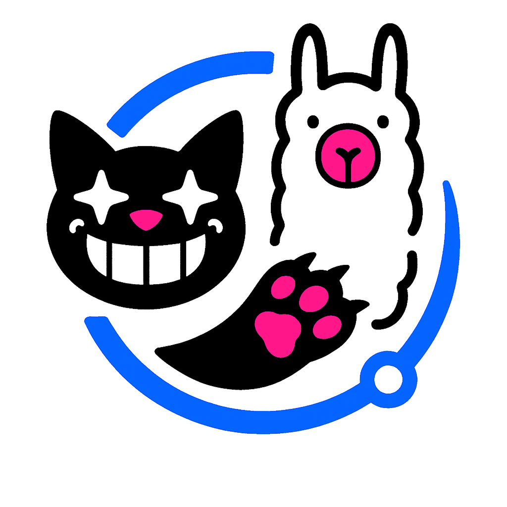

    
    <b>Claw The Ollama</b>

Automatically pull missing Ollama models for Cheshire Cat AI!

    

## Description

**Claw The Ollama** is a plugin for Cheshire Cat AI that ensures any Ollama model you request is available. If you set Ollama as your LLM or Embeddings provider, the cat will automatically pull missing models for you (with its claws).

## Features
- Detects when a requested Ollama LLM model is missing when chatting
- Detects when the configured Ollama Embeddings Model is missing
- Automatically pulls the models from Ollama
- Download any model when saving the plug-in's settings

## Usage

Just use Cheshire Cat AI as usual with Ollama as your LLM provider. If you request a model that isn't present, the plugin will pull it automatically when you send a message.

Not only, you can now download any model from Ollama from the settings in the plugin; it will be downloaded when the settings are saved.

Not only that, if the saved configuration has Ollama set as Embeddings provider, but the model is not downloaded, instead of crashing the Cat it will pull the model automatically during bootstrap.

> unfortunately , in the last two cases, there will be no notification in the UI, only logging.

## Requirements
- Cheshire Cat AI
- Ollama running and accessible
- Claw the Ollama plugin enabled in Cheshire Cat AI

## Settings

- `ollama_model`: The name of the Ollama model to pull when the settings are saved
- `base_url`: The base URL for the Ollama API (default: `http://ollama:11434`)

---
Author: Davide Modolo  
LinkedIn: https://www.linkedin.com/in/davide-modolo/

