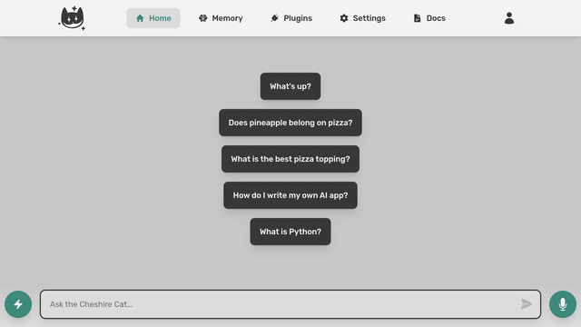

    
    <b>Claw The Ollama</b>

Automatically pull missing Ollama models for Cheshire Cat AI!

    

## Description

**Claw The Ollama** is a plugin for Cheshire Cat AI that ensures any Ollama model you request is available. If you set Ollama as your LLM provider and request a model that isn't installed, the cat will automatically pull it for you (with its claws).

## Features
- Detects when a requested Ollama model is missing
- Automatically pulls the model from Ollama
- Seamless integration with Cheshire Cat AI

## Installation

1. Place this folder inside your Cat's `plugins` directory.
2. Enable "Claw The Ollama" in the Cheshire Cat AI Plugins page.

## Usage

Just use Cheshire Cat AI as usual with Ollama as your LLM provider. If you request a model that isn't present, the plugin will fetch it automatically when you send a message.

## Requirements
- Cheshire Cat AI
- Ollama running and accessible

## Configuration
No configuration is needed.

---
Author: Davide Modolo  
LinkedIn: https://www.linkedin.com/in/davide-modolo/

